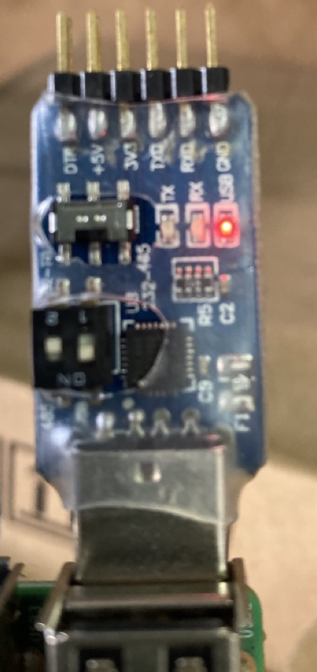
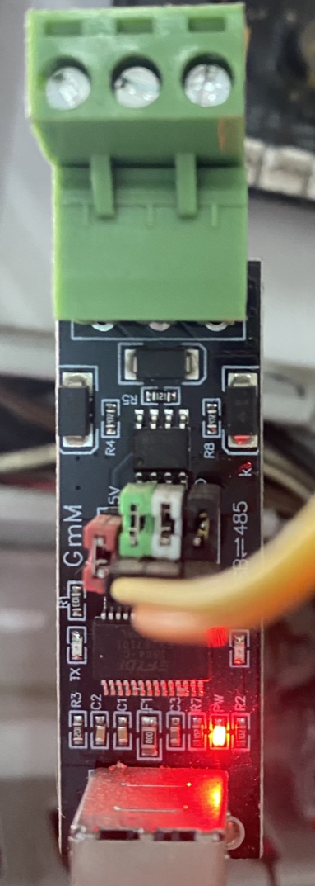

Trên raspberry có 4 cổng USB, khi mỗi lần reboot hay rút USB và cắm vào sẽ dễ bị thay đổi tên ttyUSB0 hay ttyUSB1

Hướng dẫn này sẽ giúp fix cứng cổng USB với tên cố định, hoặc fix rõ thiết bị nào ứng với cổng USB nào.

  

**1. Tìm cổng USB `dmesg | grep ttyUSB` sẽ được list USB**
----------

```
pi@raspberrypi:~ $ dmesg | grep ttyUSB 
[4.074363] usb 1-1.2: FTDI USB Serial Device converter now attached to ttyUSB0
[4.075590] usb 1-1.3: FTDI USB Serial Device converter now attached to ttyUSB1
```

* Với usb 1-1.2 là cổng số usb số 2 ứng với tên ttyUSB0, 1-1.3 là cổng usb 3 ttyUSB1

**2. Tìm thông tin của cổng USB.**
--------------
 * `udevadm info --name=/dev/ttyUSB0 --attribute-walk` thay ttyUSB0 thành cổng USB muốn check thông tin.

```
pi@raspberrypi:~ $ udevadm info --name=/dev/ttyUSB1 --attribute-walk
...
 looking at parent device '/devices/platform/soc/3f980000.usb/usb1/1-1/1-1.2':
   KERNELS=="1-1.2"
   SUBSYSTEMS=="usb"
   DRIVERS=="usb"
   ATTRS{bDeviceSubClass}=="00"
   ATTRS{bDeviceProtocol}=="00"
   ATTRS{devpath}=="1.2"
   ATTRS{idVendor}=="0403"
   ATTRS{speed}=="12"
   ATTRS{bNumInterfaces}==" 1"
   ATTRS{bConfigurationValue}=="1"
   ATTRS{bMaxPacketSize0}=="8"
   ATTRS{busnum}=="1"
   ATTRS{devnum}=="4"
   ATTRS{configuration}==""
   ATTRS{bMaxPower}=="90mA"
   ATTRS{authorized}=="1"
   ATTRS{bmAttributes}=="a0"
   ATTRS{bNumConfigurations}=="1"
   ATTRS{maxchild}=="0"
   ATTRS{bcdDevice}=="0600"
   ATTRS{avoid_reset_quirk}=="0"
   ATTRS{quirks}=="0x0"
   ATTRS{serial}=="A1LPXWF"
   ATTRS{version}==" 2.00"
   ATTRS{urbnum}=="179474001"
   ATTRS{ltm_capable}=="no"
   ATTRS{manufacturer}=="RFXCOM"
   ATTRS{removable}=="removable"
   ATTRS{idProduct}=="6001"
   ATTRS{bDeviceClass}=="00"
   ATTRS{product}=="RFXtrx433"
...
```

* Ta sẽ chú ý 2 phần  ```idVendor field (0403 in this case)``` và  ```idProduct field (6001 in this case) ``` 2 phần này ta khai báo để link thẳng thiết bị vào tên USB cố định.

**3. Tạo file Udev rule.**
---------

``` Create a file /etc/udev/rules.d/10-usb-serial.rules```

3.1 Link với tên số thiết bị.

```
SUBSYSTEM=="tty", ATTRS{idVendor}=="0403", ATTRS{idProduct}=="6001", ATTRS{serial}=="P11234567",  SYMLINK+="ttyUSB_P1"
SUBSYSTEM=="tty", ATTRS{idVendor}=="0403", ATTRS{idProduct}=="6001", ATTRS{serial}=="RFX1234567",  SYMLINK+="ttyUSB_RFX"
```

Có thể bỏ trường ```serial```

3.2 Link với cổng USB

ATTRS{devpath}=="1.1" là cổng USB số 1 trên raspberry
```
SUBSYSTEM=="tty", ATTRS{devpath}=="1.1", SYMLINK+="ttyUSB1"
SUBSYSTEM=="tty", ATTRS{devpath}=="1.2", SYMLINK+="ttyUSB2"
SUBSYSTEM=="tty", ATTRS{devpath}=="1.3", SYMLINK+="ttyUSB3"
SUBSYSTEM=="tty", ATTRS{devpath}=="1.4", SYMLINK+="ttyUSB4"
```

Can dung add ```, MODE="0666"``` vao cuoi

3.3 Bổ Xung thêm.

- Tên Driver DRIVERS=="cp210x" với USB-ttl,232,485 như hình


- Tên Driver DRIVERS=="ftdi_sio" với usb485 như hình


ta có thể link thiết bị bằng
```
KERNEL=="ttyUSB*", SUBSYSTEM=="tty", \
     DRIVERS=="cp210x", SYMLINK+="USBMultiMode", MODE="0666"
KERNEL=="ttyUSB*", SUBSYSTEM=="tty", \
     DRIVERS=="ftdi_sio", SYMLINK+="USB485", MODE="0666"
```

**4. Load new Rule.**
---------
```sudo udevadm control --reload-rules && udevadm trigger```
```pi@raspberrypi:~ $ sudo udevadm trigger```

``exit su``  thoat khoi quyen admin

**5. Check**
---------
* ```pi@raspberrypi:~ $ ls -l /dev/ttyUSB*```

