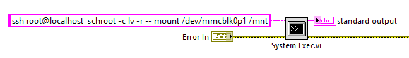
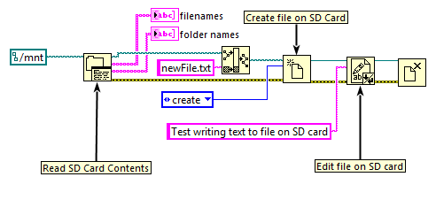

1. Setup access function outside of the labview chroot [ChrootAccessOutside](ChrootAccessOutside.md)

2.  Use the following code to mount the SD card in the LabVIEW chroot at the start of your program:

3. You can now access the SD card using standard LabVIEW IO palette. For example:
